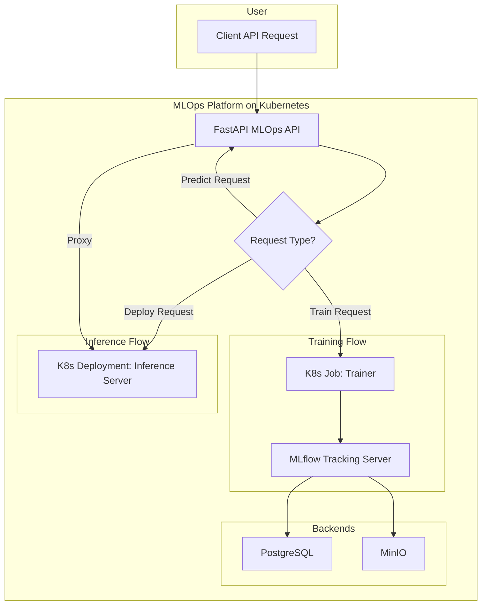

# FastAPI 기반 Kubernetes MLOps 플랫폼

## 1. 프로젝트 개요

본 프로젝트는 FastAPI를 사용하여 모델 학습 및 추론 파이프라인을 동적으로 관리하는 MLOps 플랫폼입니다. Kubernetes 클러스터 위에서 동작하며, MLflow를 통한 실험 관리 및 모델 등록, MinIO를 통한 아티팩트 저장 등 MLOps의 핵심 구성요소를 통합하여 자동화된 머신러닝 워크플로우를 제공합니다.

사용자는 간단한 API 요청만으로 모델 학습 Job을 실행하고, 학습이 완료된 모델을 즉시 추론 API 서버로 배포할 수 있습니다.

## 2. 시스템 아키텍처

### 2.1. 구성 요소

*   **FastAPI MLOps API (`fastapi-mlops-api`)**: 
    *   사용자 요청을 받는 중앙 API 게이트웨이입니다.
    *   학습(Train) 및 배포(Deploy) 요청을 받아 Kubernetes 리소스를 동적으로 생성하고 관리합니다.
    *   추론(Predict) 요청을 받아서 해당 모델이 배포된 추론 서버로 전달하는 프록시(Proxy) 역할을 수행합니다.
*   **Trainer (Kubernetes Job)**:
    *   API 요청 시 동적으로 생성되는 일회성 학습 실행 환경입니다.
    *   지정된 Docker 이미지와 소스 코드를 사용하여 모델 학습을 수행하고, 완료 후 종료됩니다.
    *   학습 과정, 파라미터, 결과 메트릭을 MLflow에 자동으로 기록합니다.
*   **Inference Server (Kubernetes Deployment)**:
    *   학습된 모델을 서빙하는 API 서버입니다.
    *   MLflow에 등록된 모델을 불러와 실시간 추론 서비스를 제공하며, 독립적으로 실행됩니다.
*   **MLflow & Backends**:
    *   **MLflow Tracking Server**: 모든 학습 실험의 파라미터, 메트릭, 아티팩트를 추적하고 모델을 등록/관리하는 Model Registry 역할을 수행합니다.
    *   **PostgreSQL**: MLflow가 사용하는 메타데이터(실험 정보, 모델 정보 등)를 저장하는 데이터베이스입니다.
    *   **MinIO**: MLflow가 생성하는 아티팩트(모델 파일, 이미지 등)를 저장하는 S3 호환 오브젝트 스토리지입니다.

### 2.2. 요청 흐름

## 3. 주요 기능

*   **RESTful API**: FastAPI를 통해 학습, 배포, 추론 파이프라인을 제어하는 표준 API 제공
*   **동적 학습 환경**: 요청에 따라 K8s Job을 동적으로 생성하여 리소스 효율성 극대화
*   **자동화된 실험 관리**: MLflow와 연동하여 모든 학습 과정을 자동으로 기록 및 추적
*   **원클릭 모델 배포**: MLflow에 등록된 모델을 API 호출 한 번으로 추론 서버에 배포
*   **모델 프로필 관리**: `model_profiles.yaml`을 통해 다양한 종류의 모델과 실행 환경(Docker 이미지, 리소스)을 유연하게 관리
*   **GPU 지원**: GPU를 사용하는 학습 및 추론 작업을 지원

## 4. 주요 환경 변수 설정

FastAPI 서버는 원활한 동작을 위해 여러 환경 변수를 필요로 합니다. 이 변수들은 `kubernetes/fastapi-mlops-api.yaml` 파일에 정의되어 있습니다.

| 환경 변수 | 설명 | 예시 값 |
| :--- | :--- | :--- |
| `K8S_NAMESPACE` | FastAPI 서버가 리소스를 생성하고 관리할 Kubernetes 네임스페이스 | `default` |
| `MLFLOW_TRACKING_URI` | 연결할 MLflow 트래킹 서버의 주소 | `http://mlflow-tracking-service:5000` |
| `MLFLOW_S3_ENDPOINT_URL` | MLflow 아티팩트 저장을 위한 MinIO 엔드포인트 | `http://minio-service:9000` |
| `AWS_ACCESS_KEY_ID` | MinIO 접근 키 (K8s Secret에서 참조) | `minio-secret`의 `MINIO_ROOT_USER` |
| `AWS_SECRET_ACCESS_KEY` | MinIO 비밀 키 (K8s Secret에서 참조) | `minio-secret`의 `MINIO_ROOT_PASSWORD` |
| `SPRING_BOOT_CALLBACK_URL`| 작업 상태 변경 시 콜백을 보낼 외부 서버 주소 | `http://your-spring-boot-service:8080/...` |
| `INTERNAL_API_KEY` | 내부 API를 보호하기 위한 API 키 (K8s Secret에서 참조) | `fastapi-internal-api-key-secret`의 `API_KEY` |

## 5. 설치 및 실행

(내용 동일, 생략)

## 6. API 명세 및 사용법

(내용 동일, 생략)

## 7. 리소스 정리

(내용 동일, 생략)

## 8. 향후 개선 과제

본 MVP 프로젝트를 실제 프로덕션 환경에서 운영하기 위해 다음과 같은 개선 과제를 고려할 수 있습니다.

### 8.1. 상태 관리 및 배포 안정성

*   **상태 관리**: 현재 실행 중인 Job과 Pod의 상태를 FastAPI 서버의 메모리(전역 변수)에서 관리하고 있습니다. 이 방식은 서버 재시작 시 모든 상태가 유실되고, API 서버를 여러 복제본(replica)으로 확장할 수 없는 심각한 문제를 야기합니다. **Redis** 또는 **PostgreSQL**과 같은 외부 공유 저장소를 도입하여 상태를 영속적으로 관리해야 합니다.
*   **배포 멱등성**: 현재 추론 서버 배포 로직은 '생성(create)'만 시도하므로, 이미 존재하는 Deployment에 재배포 요청 시 `409 Conflict` 에러가 발생합니다. `k8s_client`가 리소스를 생성할 때 없으면 생성하고, 있으면 업데이트(patch)하는 **Create-or-Update** 로직을 구현하여 배포 안정성을 확보해야 합니다.

### 8.2. 실시간 상태 알림

*   **현재 방식**: 현재 API는 생성/삭제 등 장기 실행 작업을 요청받으면 즉시 `202 Accepted`를 반환하고, 클라이언트는 별도의 `/status` API를 주기적으로 호출(Polling)하여 작업 완료 여부를 확인해야 합니다.
*   **개선 방향**: Polling 방식은 클라이언트와 서버 모두에게 비효율적일 수 있습니다. **WebSockets** 또는 **Server-Sent Events (SSE)**를 도입하여, 작업이 완료되거나 상태가 변경될 때 서버가 클라이언트에게 직접 알림을 푸시(Push)하는 방식으로 사용자 경험을 향상시킬 수 있습니다.

### 8.3. 아키텍처 유연성 확보

*   **추론 서버 전문화**: 현재 모든 모델 타입을 단일 `inference_server.py`로 처리하고 있어 로직이 복잡합니다. 모델 종류(tabular, text, image)에 따라 전문화된 추론 서버 Docker 이미지를 별도로 구축하고, `model_profiles.yaml`에서 선택하도록 하여 각 서버의 책임을 명확히 분리하는 것이 좋습니다.
*   **학습 파이프라인 결합도 완화**: 현재 오케스트레이터가 `train.py`에 필요한 모든 인자를 커맨드 라인 인자로 직접 만들어 전달하여, 두 컴포넌트가 강하게 결합되어 있습니다. 학습 설정을 단일 JSON 파일로 관리하고 파일 경로만 전달하는 방식으로 변경하여 결합도를 낮추고 유연성을 높일 수 있습니다.

### 8.4. 모니터링 및 로깅

*   **중앙화된 로깅**: 현재 로그가 각 Pod에 흩어져 있어 추적이 어렵습니다. **Fluentd/Loki** 등으로 로그를 한 곳에 모으고 **Elasticsearch/Grafana**로 검색 및 시각화하는 중앙 로깅 시스템이 필요합니다.
*   **모니터링 및 알림**: **Prometheus**와 **Grafana**를 사용하여 시스템의 핵심 성능 지표(API 응답 시간, 에러율, 리소스 사용량 등)를 모니터링하고, 이상 상황 발생 시 **Alertmanager**로 알림을 받는 체계를 구축해야 합니다.

### 8.5. CI/CD 파이프라인 구축

*   **GitHub Actions**, **Jenkins** 등의 도구를 사용하여 테스트, Docker 이미지 빌드, Kubernetes 리소스 배포 과정을 자동화하는 CI/CD 파이프라인을 구축하여 개발 및 운영 효율성을 높여야 합니다.
